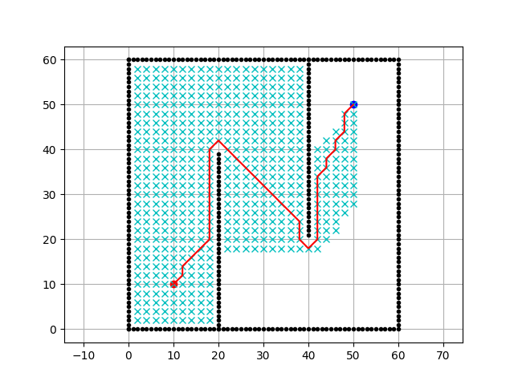
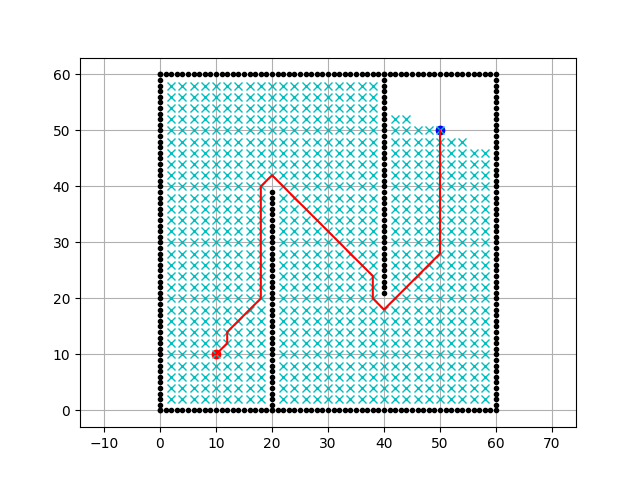
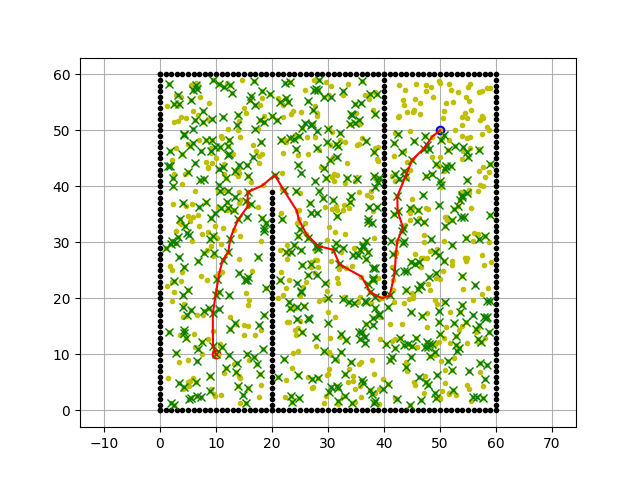
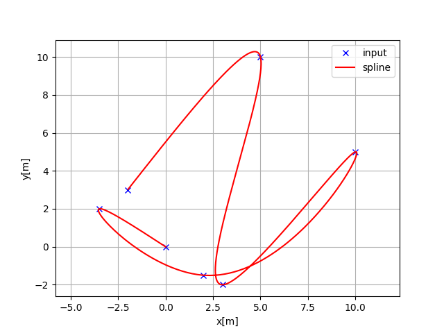
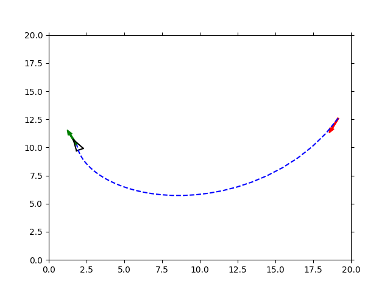
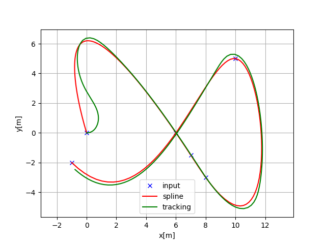
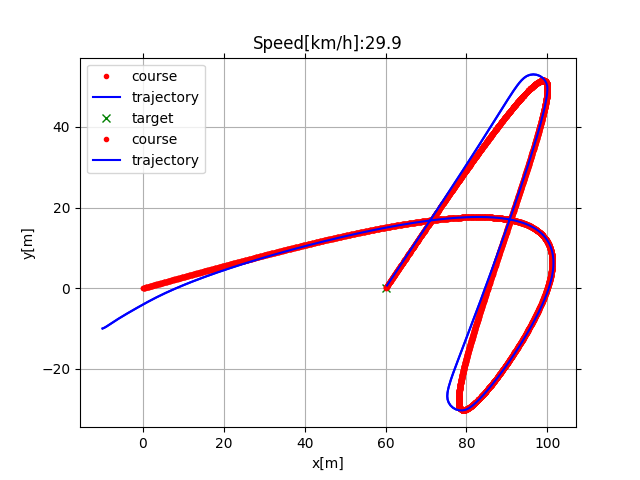

# Mobile Robot using Python
## Environment
Python 3<br>
```
pip install -r requirements.txt
```
## Table of Contents
1. [Path Planning](path_planning)
    * A Star
    * Dijkstra
    * Probabilistic Road Map
    * Cubic Spline (path generator from point)
2. [Path Tracking](path_tracking)
    * Move to Pose
    * Rear Wheel Feedback
    * Stanley Control

## Results
### Path Planning
#### A Star


#### Dijkstra


#### Probabilistic Road Map


#### Cubic Spline path generation


### Path Tracking
#### The bicycle model
The robot kinematic model was used in this package is Car-like robot model.
#### Move to Pose

#### Rear Wheel Feedback

#### Stanley Control
