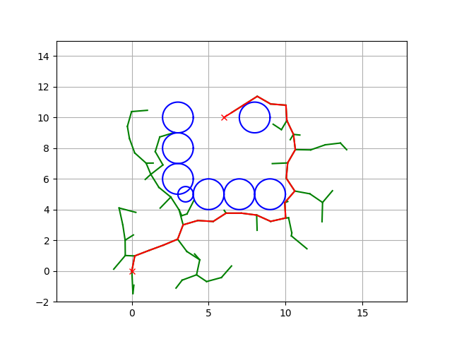
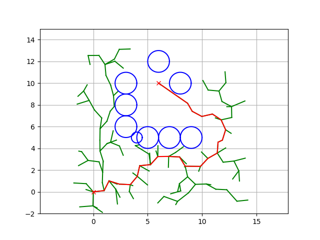
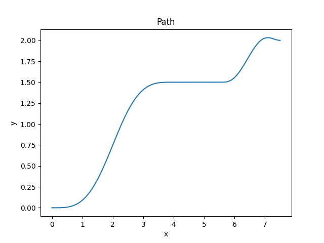
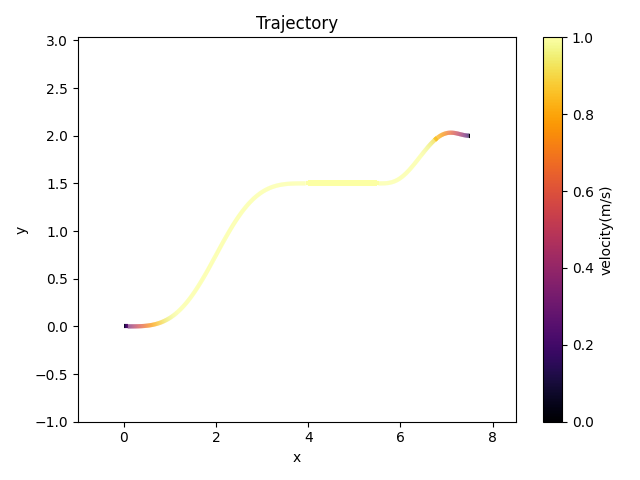
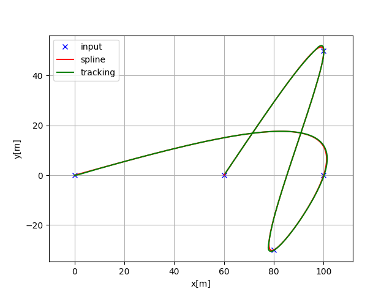
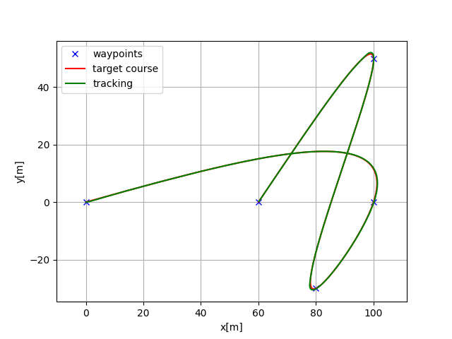
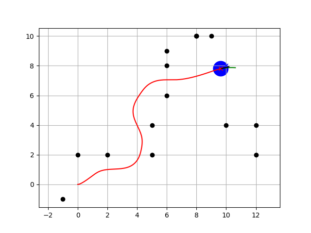
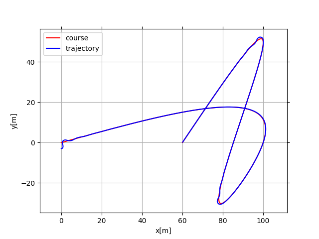

# Mobile Robot using Python
## Environment
Python 3<br>
```
pip install -r requirements.txt
```
## Table of Contents
1. [Path Planning](path_planning)
    * A Star
    * Dijkstra
    * Probabilistic Road Map
    * Rapidly-exploring random tree
    * Cubic Spline (path generator from point)
2. [Path Tracking](path_tracking)
    * Linear MPC
    * LQR Steering / Speed Steering
    * Move to Pose
    * Rear Wheel Feedback
    * Stanley Control

## Results
### Path Planning
#### A Star

#### Dijkstra

#### Probabilistic Road Map

#### Rapidly-exploring Random Tree

#### Rapidly-exploring Random Tree Star

#### Cubic Spline path generation

#### Eta3 Spline path generation

Eta3 Spline with velocity constraints:


### Path Tracking
#### The Car-like Mobile Robot model
The robot kinematic model was used in this package is Car-like robot model. For more information, please consider the [Car-like Mobile Robot](docs/car-like_robot_model.md)
#### Linear MPC

#### LQR Steering

#### LQR Speed Steering

#### Move to Pose

#### Move to Pose with Obstacle avoiding using Dynamic Window Approach

#### Pure Pursuit

#### Rear Wheel Feedback

#### Stanley Control
