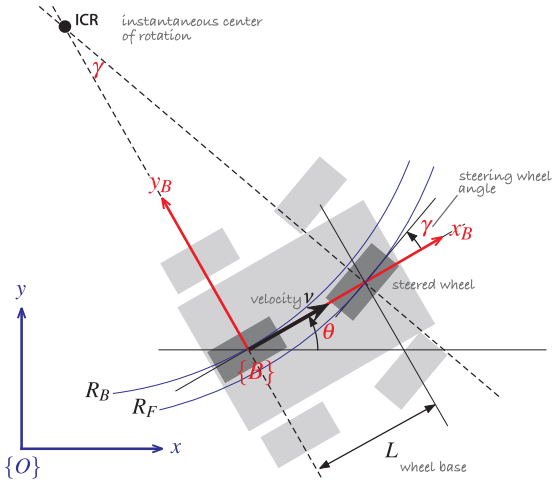

# Car-like Mobile Robot Model

## Introduction
The configuration of the vehicle is represented by the generalized coordinates $\mathbf{q} = \left(\begin{array}{ccc} x & y & \theta \end{array}\right)^T \in \mathbb{R}^2\times\mathbb{S}^1$. 
The dashed lines show the direction along which the wheels cannot move, the lines of no motion, and these intersect at a point known as the Instantaneous Center of Rotation (ICR). 
The reference point of the vehicle thus follows a circular path and its angular velocity is:
$$\dot{\theta} = \frac{v}{L}\tan{\gamma}$$
where:  
$L$ - the length of the vehicle; 
$\gamma$ -  the steering angle;  
$v$ - the velocity; 

## Kinematic
The velocity of the robot in the world frame:
$$\dot{x}=\upsilon\cos\theta$$
$$\dot{y}=\upsilon\sin\theta$$
$$\dot{\theta}=\frac{v}{L}\tan\gamma$$

The control of Car-like mobile robot is acceleration $a$ and steering angle $\gamma$. Where:
$$ a = \dot{v}$$

## Discretization
In this package, we are using Euler discretized method to discretize the continuous system, where $\text{dt}$ is the time step:

$$ x(k+1) = x(k) + v\cos(\theta)\text{dt} $$
$$ y(k+1) = y(k) + v\sin(\theta)\text{dt} $$
$$ \theta(k+1) = \theta(k) + \frac{v}{L}\tan(\gamma)\text{dt} $$
$$ v(k+1) = v(k) + a\text{dt}$$

* **Note:** The angle of Car-like mobile robot is always limited in range $(-\pi, \pi)$. So, we always have to normalize the angle by:
$$ \theta = \theta - 2\pi\left\lfloor\frac{\theta + \pi}{2\pi}\right\rfloor $$

## Constraints
In actual, the car-like mobile robot can not be too large velocity and too large steering angle. So, we alway have the constraints:
$$ \left|v\right| \leq v_\text{max} $$
$$ \left|\gamma \right| \leq \gamma_\text{max} < \frac{\pi}{2}$$