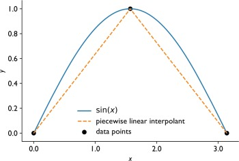

# The  Cubic Spline Interpolation
## Introduction
A cubic spline is a piecewise cubic function that interpolates a set of data points and guarantees smoothness at the data points. 

Before discuss about cubic splines, we will develop the concept of piecewise linear fits.  
## The concept of piecewise linear fits.
If we have several points, but do not want to have a high degree polynomial interpolant because of fear of the Runge phenomenon, we could do linear interpolation between each of the points. 

This fit is OK, but it has some problems. The primary one is that it is not smooth at the data points: the function has a discontinuous derivative at some of the points. This would be the case even if we knew that the underlying function should be smooth. Also, a linear interpolant is not a good fit to the function: above we had much better luck with quadratics and cubics. 

To guarantee a degree of accuracy, avoid the oscillations we have seen before, and get smooth functions we can, and should, use cubic spline interpolants. Cubic spline interpolants are continuous in the zeroth through second derivatives and pass through all the data points.  

## Setup the algorithm

Begin with the data points (knot points), this implies n intervals and  interior (not at the beginning or end) points. 
Denote the cubic on the interval from point $(i-1)$ to $i$ as:
$$ f_i(x) = a_i + b_i x + c_i x^2 + d_i x^3 $$
The cubics need to match at the knot points:
$$ f_1(x) = y_1 $$
$$ f_i(x_{i+1}) = f_{i+1}(x_{i+1}) = y_{i+1} $$
$$ f_n(x_{n+1}) = y_{n+1} $$
where: $ 1 \leq i < n$ 
which are $2n$ total conditions, when the end points are included. In equation form these become
$$ a_1 + b_1 x_1 + c_1 x_1^2 + d_1 x_1^3 = y_1 $$
$$ a_{i+1} + b_{i+1} x_{i+1} + c_{i+1} x_{i+1}^2 + d_{i+1} x_{i+1}^3 = a_{i} + b_{i} x_{i+1} + c_{i} x_{i+1}^2 + d_{i} x_{i+1}^3 = y_{i+1} $$
$$ a_n + b_n x_{n+1} + c_n x_{n+1}^2 + d_{n} x_{n+1}^3 = y_{n+1} $$

Also, we need to make the derivatives continuous at the  interior knot points,
$$ f'_i(x_{i+1}) = f'_{i+1}(x_{i+1}) $$
where $ 1 \leq i < n $ 

The $n-1$ equation for this are:
$$ b_{i+1} + 2c_{i+1} x_{i+1} +3d_{i+1} x_{i+1}^2 = b_{i+1} + 2c_{i+1} x_{i} +3d_{i+1} x_{i}^2 $$
where $ 1 \leq i < n $  

Finally, we need to make the second derivatives continuos at the interior knot point
$$ f''_i =(x_{i+1}) = f''_{i+1} (x_{i+1}) $$
where $ 1 \leq i < n $  

The $n-1$ equations for equality are:
$$ 2c_{i+1} + 6d_{i+1}x_{i+1} = 2c_{i} + 6d_{i}x_{i+1} $$

For the $n$ intervals there are $4n$ unknowns (4 coefficients for each cubic). We have $4n-2$ equations at this point so we need two more equations. The natural choice is to set the second derivative to be zero at the two endpoints:
$$ f_1''(x_1) = 0 ; f''_n(x_{n+1}) = 0 $$
We now have $4n$ equations and $4n$ unknowns. 
