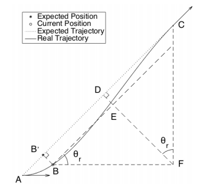

# LQR Steering Controller for Path Tracking
## Robot Model
Robot model: [Car-like Mobile Robot](car-like_robot_model.md)  
### Kinematic
$$ \dot{x} = v\cos(\theta) $$
$$ \dot{y} = v\sin(\theta) $$
$$ \dot{\theta} = \frac{v}{L}\tan(\gamma) $$

### Contraints
$$ |\gamma| \leq \gamma_\text{max} $$

## Tracking Control
### Error model
Current state: $\left(\begin{array}{ccc} x_c & y_c & \theta_c \end{array}\right)^T$ 
Target position: $\left(\begin{array}{cc} x_t & y_t  \end{array}\right)^T$  
Expected orientation: $\theta_r$  
The error of position and orientation:

$$ \mathbf{e} = \left[ \begin{array}{c} x_c - x_t \\ y_c - y_t \\ \theta_c - \theta_r \end{array}\right]$$

where:
$$\theta_r = \tan^{-1}\frac{y_c - y_0}{x_c - x_0} $$
therefore:
$$ \sin\theta_r (x_c - x_0) - \cos\theta_r (y_c - y_0) = 0$$

The geometrical transformation of error:

In the figure, A is the starting pose, C is the terminal, B' is expected point corresponding to B. It is the aim of control to make B
close to B’.  

Consider: 
$d$ - the distance between the current position B and the expected point B'.  
$s$ - the distance between the expected point B' and the target point C.  
$$ d = (y_t - y_c)\cos\theta_r - (x_t - x_c)\sin\theta_r $$
$$ s = (y_t - y_c)\sin\theta_r - (x_t - x_c)\cos\theta_r $$

The error of tracking is composed of $s$, $d$ and $\theta_e$
$$ \left[\begin{array}{c} s \\ d \\ \theta_e \end{array}\right] = \left[\begin{array}{ccc} -\cos\theta_r & -\sin\theta_r & 0 \\ \sin\theta_r & -\cos\theta_r & 0 \\ 0 & 0 & 1 \end{array}\right] \mathbf{e} = \mathbf{T} \mathbf{e}$$

The dynamic equation of tracking error:
$$ \left[\begin{array}{c} \dot{s} \\ \dot{d} \\ \dot{\theta_e} \end{array}\right] = \mathbf{T} \dot{\mathbf{e}} = \left[ \begin{array}{c} -v\cos\theta_e \\ -v\sin\theta_e \\ \left(v\tan\gamma \right)/L \end{array} \right]$$

Define:
$$ \dot{\mathbf{X}} = \left[ \begin{array}{c} \dot{d} \\ \dot{\theta}_c \end{array} \right] = \left[ \begin{array}{c} -v_r\sin\theta_e \\ (v_r\tan\gamma)/L \end{array} \right] $$

The equation of state is non-linear

### Linearization
Linear approximation with little deviation
$$ \sin\theta_e \approx \theta_e $$
$$ \tan\gamma \approx \gamma $$
Therefore:
$$ \dot{\mathbf{X}} = \left[ \begin{array}{c} -v_r\theta_r \\ -v_r\gamma/L\end{array} \right] = \left[ \begin{array}{cc} 0 & -v_r \\ 0 & 0 \end{array} \right] \mathbf{X} + \left[\begin{array}{c} 0 \\ -v_r/L \end{array}\right]\gamma  = \mathbf{A}\mathbf{X} + \mathbf{B}\gamma $$

### LQR Design
$$ J = \sum_{t_0}^{+\infty}\left( \mathbf{X}^T\mathbf{Q}\mathbf{X} + \gamma^T\mathbf{R}\gamma \right)\text{dt} $$
where $\mathbf{Q}, \mathbf{R}$ is the positive-diagonal matrix.