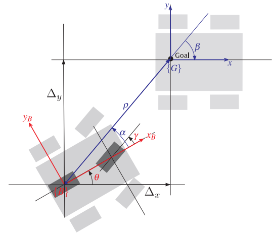

# Move to Pose
## Description
Robot model: [Car-like Mobile Robot](car-like_robot_model.md)  
Problem: Robot moves from pose $B(\begin{array}{ccc} x&y&\theta\end{array})^T$ to pose $G(\begin{array}{ccc} x_g & y_g & \theta_g \end{array})^T$

## Solve the problem
Current state: $(\begin{array}{ccc} x&y&\theta\end{array})^T$  
Goal state: $(\begin{array}{ccc} x_g & y_g &\theta_g \end{array})^T$  

Transform to the polar coordinate:
$$ \rho = \sqrt{\Delta_x^2 + \Delta_y^2}$$
$$ \alpha = \tan^{-1}\frac{\Delta_y}{\Delta_x} - \theta $$
$$ \beta = -\theta - \alpha $$

where:
$$ \Delta_x = x - x_g $$
$$ \Delta_y = y - y_g $$

The linear control law:
$$ v = k_\rho \rho $$
$$ \omega = k_\alpha \alpha + k_\beta \beta $$
$$ \gamma = \tan^{-1}\frac{\omega L}{v}$$

The stable conditions: $k_\rho > 0; k_\beta < 0; k_\alpha - k_\rho > 0$